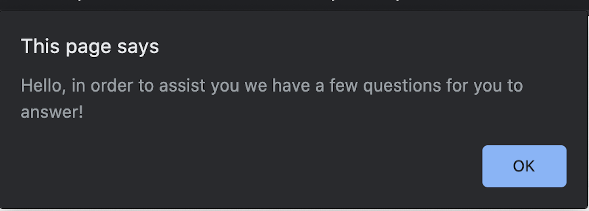
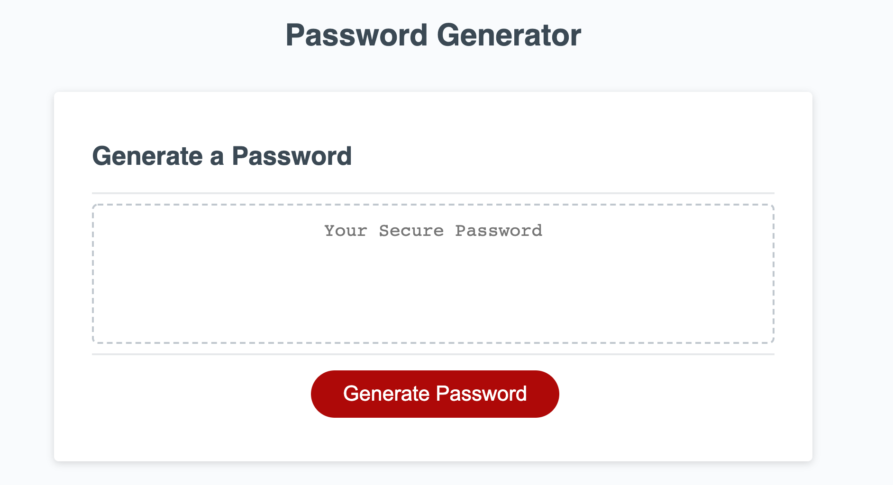

# Secure-Password-Generator
  
In a growing world of cyber threats a secure password is crucial to businesses and personal users. This isn't "The Office" where you can join the likes of multiple cast members and use "password" as your password. Protect your info from cyber predators. 
I have been assigned a task of implementng a password generator  that will assist users in creating a password set by their own parameters with just a few answered questions. 

The layout was created using html, css, and js. 

